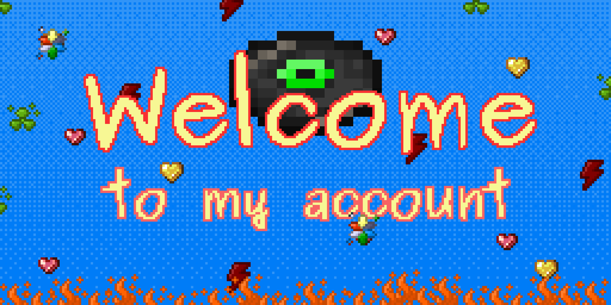

**👋  Welcome to my account!**

**Here you will find my projects, repositories with useful code, links to my social networks and other resources.**

## A little about me 😅

**I live in Russia🇷🇺.** 
**I am engaged in the development of *bots🤖*, *servers🌐*, *AI💻* and everything that interests me.**

## **My knowledge**
### **✅ At the moment I know the following:**
* **Node.js**
* TypeScript
* PHP
* **Python**
* Shell Script
* batch
* **MongoDB**
* **MySQL**
* SQLITE3
* HTML

*A lot of things, but from this I know best: Node.js and Python*
## **I use** 👾

### **🗂️ Here are my favorite libraries:**
* **JavaScript**
	* **Discord.js**
	* **React**
* **Python**
	* **Rich**
	* **Discord.py**

### **🌱 I work in the following applications:**
* **Aseprite**
* **IDE:**
	* Atom
	* SublimeText
	* **Visual Studio Code**

### **🌈 Plugins that I use:**
* **ESLint**
* **Prettier**
* **Husky**
* **Nodemon**

## My OS

## My contacts 🗂️

